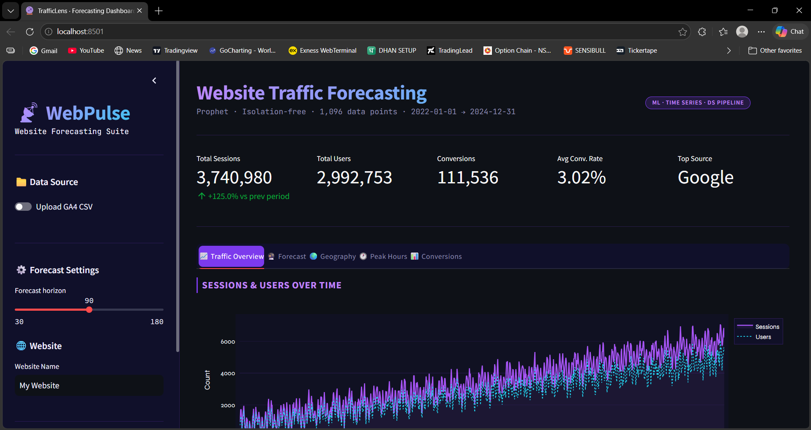
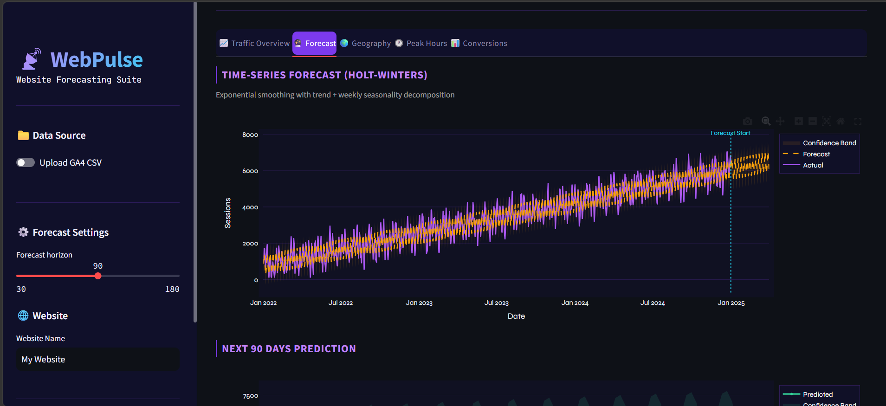
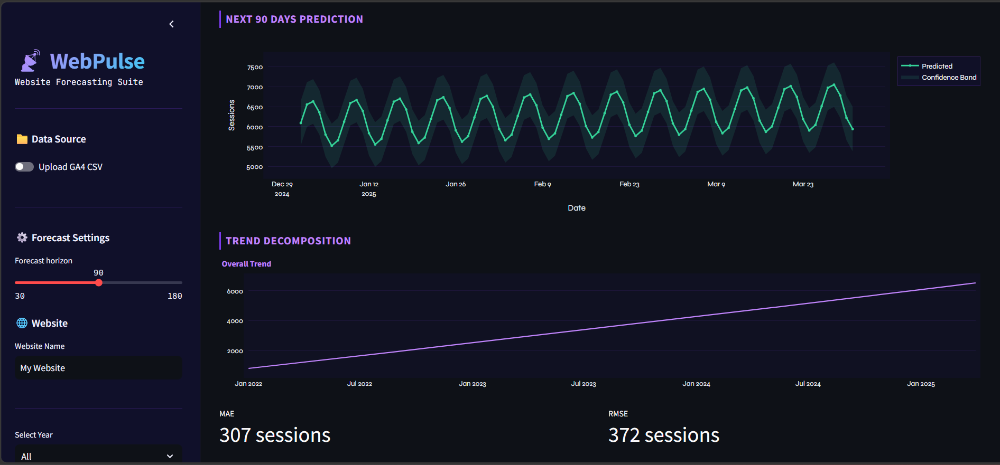
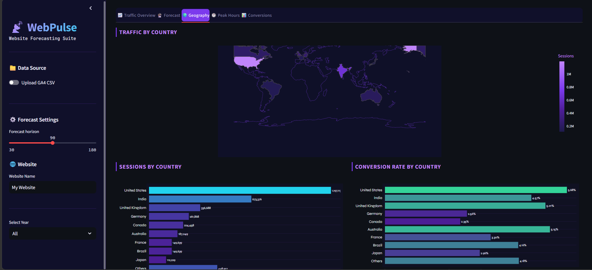
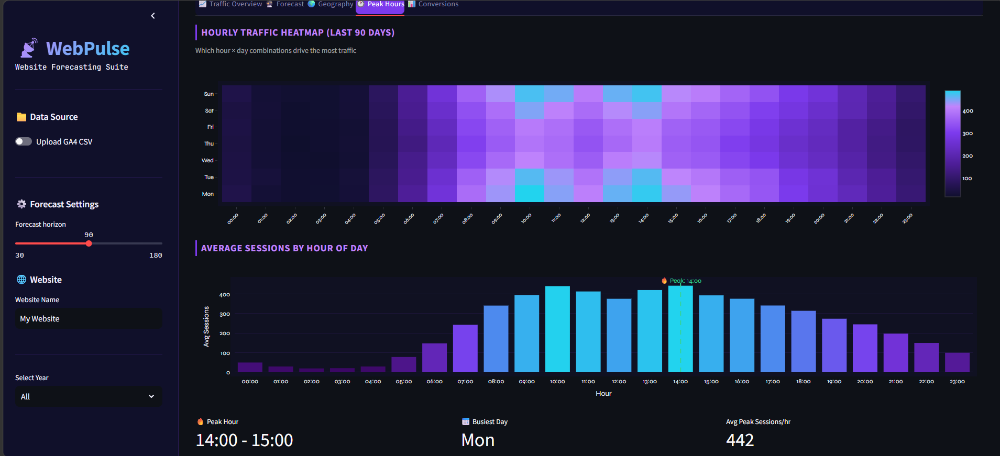
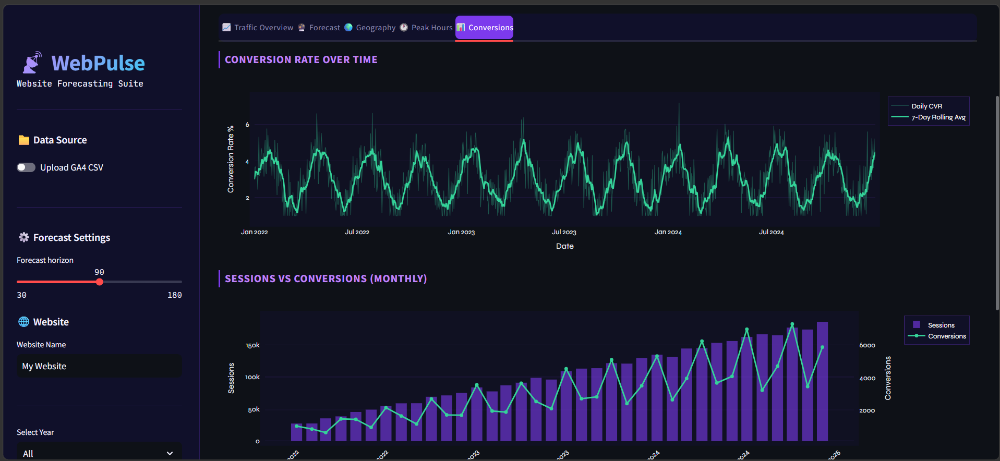

# 📈 Website Traffic Forecasting & Analytics Dashboard

An interactive analytics dashboard built using **Python, Streamlit, Plotly, and Machine Learning** to analyze website traffic, visualize user behavior, track conversions, and forecast future website traffic trends.

---

## 🚀 Project Overview

The Website Traffic Forecasting & Analytics Dashboard is designed to help businesses, marketers, and analysts understand website performance through interactive visualizations and predictive analytics.

The application supports both **Google Analytics 4 (GA4) CSV datasets** and generated sample datasets, allowing users to explore traffic trends, analyze user engagement, monitor conversions, and forecast future traffic using time-series forecasting techniques.

---

## ✨ Key Features

### 📊 Traffic Analytics

* Session and user analysis
* Traffic trend monitoring
* KPI dashboards
* Historical performance tracking

### 📈 Traffic Forecasting

* Future traffic prediction
* Trend decomposition
* Forecast confidence intervals
* Custom forecast horizon

### 🌍 Geographic Analysis

* Country-wise traffic distribution
* Interactive world map visualization
* Conversion rate analysis by country

### ⏰ Peak Hour Analysis

* Hourly traffic heatmaps
* Peak traffic hour identification
* Busiest day detection
* User activity insights

### 🎯 Conversion Analytics

* Conversion tracking
* Conversion rate monitoring
* Session vs conversion comparison
* Business performance evaluation

### 📁 Flexible Data Sources

* Upload GA4 CSV datasets
* Upload custom website traffic data
* Generate sample datasets
* Automatic data validation

---

# 📸 Dashboard Screenshots

## Dashboard Overview



*Main dashboard displaying website KPIs, traffic overview, and user analytics.*

---

## Traffic Forecasting



*Future website traffic prediction with confidence intervals and forecasting visualization.*

---

## Next 90 Days Prediction & Trend Analysis



*Trend decomposition and short-term traffic forecasting analysis.*

---

## Geographic Traffic Analysis



*Country-wise traffic distribution and conversion performance analysis.*

---

## Peak Hour Analysis



*Heatmap showing busiest traffic hours and user activity patterns.*

---

## Conversion Analysis



*Conversion trends and session-to-conversion performance monitoring.*

---

## 🏗️ System Architecture

```text
User Input
     │
     ▼
Dataset Validation
     │
     ▼
Data Preprocessing
     │
     ▼
Processing & Analysis
     │
 ┌───┴────┐
 ▼        ▼
Visualization  Forecasting
     │        │
     └───┬────┘
         ▼
 Output Dashboard
```

---

## 🛠️ Tech Stack

### Programming Language

* Python

### Framework

* Streamlit

### Libraries

* Pandas
* NumPy
* Plotly
* Scikit-Learn
* Prophet
* PyStan

### Development Tools

* Visual Studio Code
* Jupyter Notebook

---

## 📂 Project Structure

```text
website-traffic-forecasting-dashboard/
│
├── screenshots/
│   ├── dashboard_overview.png
│   ├── traffic_forecasting.png
│   ├── prediction_90_days.png
│   ├── geographical_analysis.png
│   ├── peak_hour_analysis.png
│   └── conversion_analysis.png
│
├── data/
├── sample_data/
│
├── app.py
├── forecaster.py
├── anomaly.py
├── data_generator.py
├── make_samples.py
├── test.py
│
├── requirements.txt
└── README.md
```

---

## ⚙️ Installation

### Clone Repository

```bash
git clone https://github.com/yourusername/website-traffic-forecasting-dashboard.git
cd website-traffic-forecasting-dashboard
```

### Create Virtual Environment

```bash
python -m venv venv
```

### Activate Environment

Windows:

```bash
venv\Scripts\activate
```

Linux/macOS:

```bash
source venv/bin/activate
```

### Install Dependencies

```bash
pip install -r requirements.txt
```

### Run Application

```bash
streamlit run app.py
```

---

## 📊 Dashboard Modules

### 1. Traffic Overview

* Sessions Analysis
* User Analytics
* KPI Monitoring
* Traffic Trends

### 2. Forecasting

* Traffic Prediction
* Trend Analysis
* Forecast Confidence Bands
* Future Growth Insights

### 3. Geography

* Traffic by Country
* Regional Analysis
* Conversion Rate by Country

### 4. Peak Hours

* Hourly Traffic Heatmap
* Peak Activity Detection
* Busiest Day Analysis

### 5. Conversions

* Conversion Rate Trends
* Monthly Conversion Analysis
* Session vs Conversion Comparison

---

## 🎯 Applications

* Website Performance Monitoring
* Digital Marketing Analytics
* E-Commerce Analytics
* Business Intelligence
* User Behavior Analysis
* Resource Planning
* Content Strategy Planning
* Educational Data Science Projects

---

## 🔮 Future Enhancements

* Real-time Data Streaming
* Google Analytics API Integration
* Advanced ML Forecasting Models
* LSTM-based Deep Learning Forecasting
* Multi-user Authentication
* Cloud Deployment
* Automated Report Generation
* Export Dashboard Reports

---

## 📚 Learning Outcomes

This project demonstrates practical implementation of:

* Data Analysis
* Data Visualization
* Predictive Analytics
* Time-Series Forecasting
* Dashboard Development
* Business Intelligence
* Data Preprocessing
* Streamlit Application Development

---

## 👨‍💻 Author

**Nilakanth Talawar**

Bachelor of Engineering (Computer Science & Engineering)

KLE College of Engineering & Technology, Chikodi

Data Science Internship Project – Take It Smart (OPC) Pvt. Ltd.

---

## ⭐ If you found this project useful, consider giving it a star!

This project is licensed under the MIT License.
